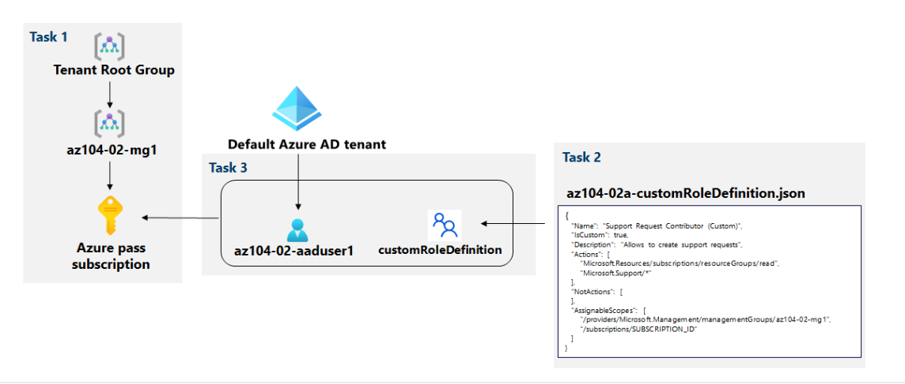
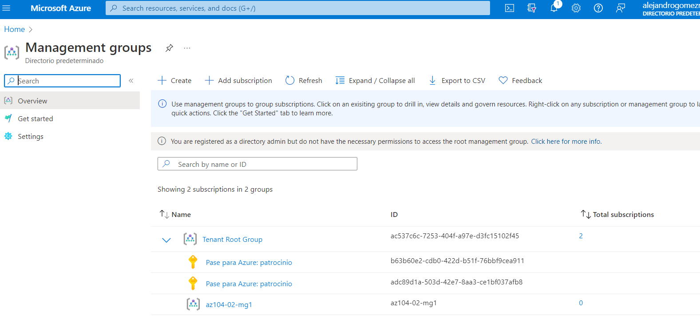
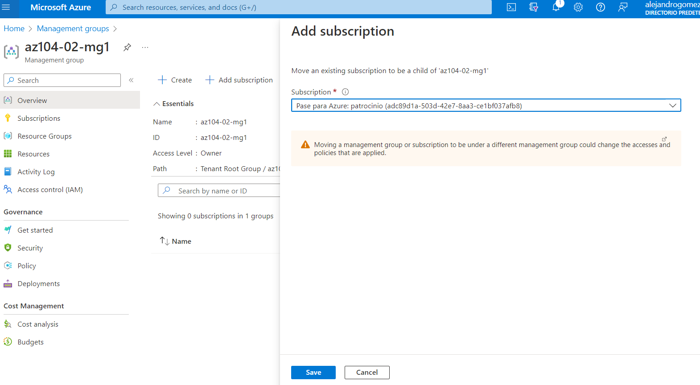
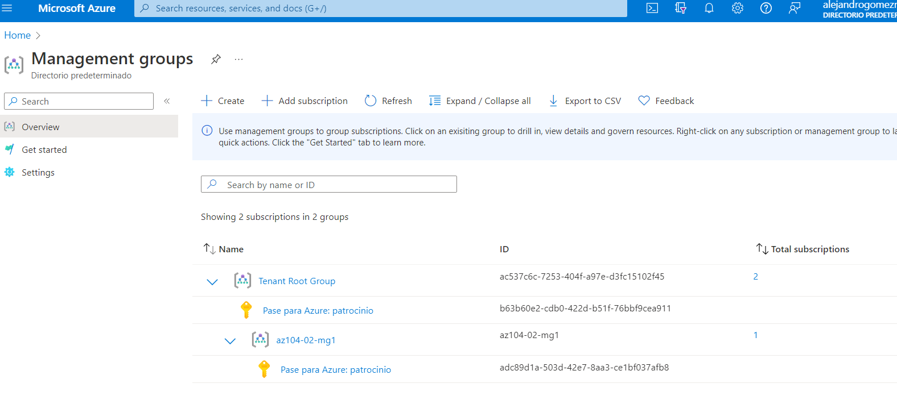
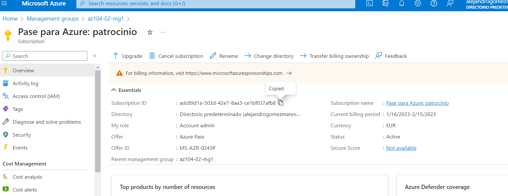
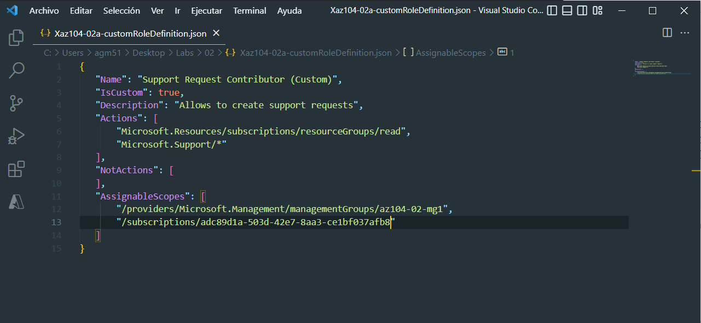
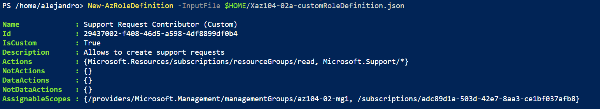
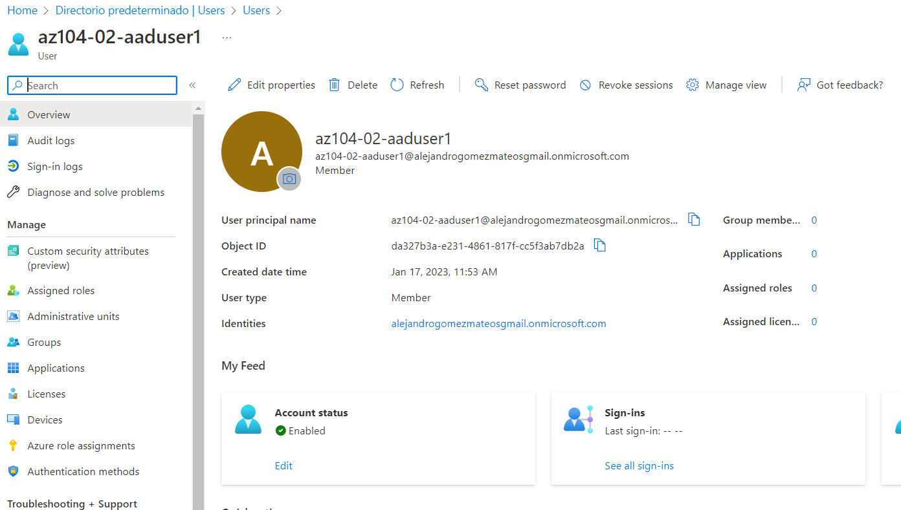
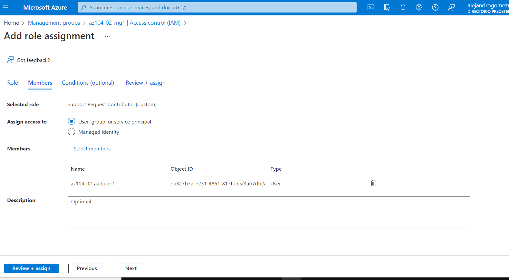

# Laboratorio 2a: Administrar suscripciones y RBAC

## Requisitos de laboratorio
Este laboratorio requiere permisos para crear usuarios de Azure Active Directory (Azure AD), crear roles personalizados de control de acceso basado en roles (RBAC) de Azure y asignar estos roles a usuarios de Azure AD. No todos los anfitriones de laboratorio pueden proporcionar esta capacidad. Pregunte a su instructor por la disponibilidad de este laboratorio.

## Escenario de laboratorio
Para mejorar la administración de los recursos de Azure en Contoso, se le asignó la tarea de implementar la siguiente funcionalidad:

crear un grupo de administración que incluiría todas las suscripciones de Azure de Contoso

otorgar permisos para enviar solicitudes de soporte para todas las suscripciones en el grupo de administración a un usuario designado de Azure Active Directory. Los permisos de ese usuario deben limitarse solo a:

crear tickets de solicitud de soporte
ver grupos de recursos
Nota: Hay disponible una simulación de laboratorio interactiva que le permite hacer clic en este laboratorio a su propio ritmo. Es posible que encuentre ligeras diferencias entre la simulación interactiva y el laboratorio alojado, pero los conceptos e ideas centrales que se demuestran son los mismos.

## Objetivos
En este laboratorio, usted:

- Tarea 1: Implementar grupos de administración
- Tarea 2: Crear funciones de RBAC personalizadas
- Tarea 3: Asignar funciones de RBAC

**Tiempo estimado: 30 minutos**

## Diagrama de arquitectura



## Instrucciones
### Ejercicio 1
### Tarea 1: Implementar grupos de administración.
En esta tarea, creará y configurará grupos de administración.

1. Inicie sesión en el portal de Azure .

2. Busque y seleccione Grupos de administración para navegar a la hoja Grupos de administración .



3. Revise los mensajes en la parte superior de la hoja Grupos de administración . Si ve el mensaje que indica que está registrado como administrador del directorio pero no tiene los permisos necesarios para acceder al grupo de administración raíz , realice la siguiente secuencia de pasos:

    a. En Azure Portal, busque y seleccione Azure Active Directory .

    b. En la hoja que muestra las propiedades de su arrendatario de Azure Active Directory, en el menú vertical del lado izquierdo, en la sección Administrar , seleccione Propiedades .

    c. En la hoja Propiedades de su arrendatario de Azure Active Directory, en la sección Administración de acceso para recursos de Azure , seleccione Sí y luego seleccione Guardar .

    d. Vuelva a la hoja Grupos de administración y seleccione Actualizar .

4. En la hoja Grupos de administración , haga clic en + Crear .



**Nota :** si no ha creado grupos de administración anteriormente, seleccione Comenzar a usar grupos de administración

5. Cree un grupo de administración con la siguiente configuración:

| Configuración | Valor |
|  -- | -- |
| Id. de grupo de administración | **az104-02-mg1** |
| Nombre para mostrar del grupo de administración | **az104-02-mg1** |
| | |



6. En la lista de grupos de administración, haga clic en la entrada que representa el grupo de administración recién creado.

7. En la hoja az104-02-mg1 , haga clic en Suscripciones .

8. En el az104-02-mg1 | Hoja Suscripciones , haga clic en + Agregar , en la hoja Agregar suscripción , en la lista desplegable Suscripción , seleccione la suscripción que está usando en este laboratorio y haga clic en Guardar .



**Nota :** En el az104-02-mg1 | Hoja de suscripciones , copie el ID de su suscripción de Azure en el Portapapeles. Lo necesitará en la siguiente tarea.

### Tarea 2: Crear funciones de RBAC personalizadas
En esta tarea, creará una definición de un rol RBAC personalizado.

1. Desde la computadora del laboratorio, abra el archivo **\Allfiles\Labs\02\az104-02a-customRoleDefinition.json** en el Bloc de notas y revise su contenido:

```
{
   "Name": "Support Request Contributor (Custom)",
   "IsCustom": true,
   "Description": "Allows to create support requests",
   "Actions": [
       "Microsoft.Resources/subscriptions/resourceGroups/read",
       "Microsoft.Support/*"
   ],
   "NotActions": [
   ],
   "AssignableScopes": [
       "/providers/Microsoft.Management/managementGroups/az104-02-mg1",
       "/subscriptions/SUBSCRIPTION_ID"
   ]
}
```

**Nota :** Si no está seguro de dónde se almacenan localmente los archivos en su entorno de laboratorio, consulte a su instructor.

> - Reemplace el `SUBSCRIPTION_ID` marcador de posición en el archivo JSON con el ID de suscripción que copió en el Portapapeles y guarde el cambio.



3. En Azure Portal, abra el panel de Cloud Shell haciendo clic en el icono de la barra de herramientas directamente a la derecha del cuadro de texto de búsqueda.

4. Si se le solicita que seleccione Bash o PowerShell , seleccione PowerShell .

**Nota :** si es la primera vez que inicia Cloud Shell y aparece el mensaje No tiene almacenamiento montado , seleccione la suscripción que está usando en este laboratorio y haga clic en Crear almacenamiento .

5. En la barra de herramientas del panel de Cloud Shell, haga clic en el ícono Cargar/Descargar archivos , en el menú desplegable, haga clic en Cargar y cargue el archivo \Allfiles\Labs\02\az104-02a-customRoleDefinition.json en el directorio de inicio de Cloud Shell .

6. Desde el panel de Cloud Shell, ejecute lo siguiente para crear la definición de función personalizada:

```
New-AzRoleDefinition -InputFile $HOME/az104-02a-customRoleDefinition.json
```


7. Cierre el panel de Cloud Shell.


### Tarea 3: Asignar funciones de RBAC
En esta tarea, creará un usuario de Azure Active Directory, asignará la función RBAC que creó en la tarea anterior a ese usuario y verificará que el usuario puede realizar la tarea especificada en la definición de la función RBAC.

1. En Azure Portal, busque y seleccione Azure Active Directory , en la hoja de Azure Active Directory, haga clic en Usuarios y luego haga clic en + Nuevo usuario .

2. Cree un nuevo usuario con la siguiente configuración (deje los demás con sus valores predeterminados):

| Configuración	Valor
|  -- | -- |
| Nombre de usuario	| **az104-02-aaduser1** |
| Nombre | **az104-02-aaduser1** |
| Déjame crear la contraseña. | activado |
| Contraseña inicial | Proporcione una contraseña segura |
| | |

**Nota :** Copie en el portapapeles el nombre de usuario completo . Lo necesitará más adelante en este laboratorio.

3. En Azure Portal, vuelva al grupo de administración az104-02-mg1 y muestre sus detalles .



4. Haga clic en Control de acceso (IAM) , haga clic en + Agregar y luego en Agregar asignación de roles . En la pestaña Rol , busque Colaborador de solicitud de soporte (personalizado) .

**Nota :** si su función personalizada no está visible, la función personalizada puede tardar hasta 10 minutos en aparecer después de la creación.

5. Seleccione el Rol y haga clic en Siguiente . En la pestaña Miembros , haga clic en + Seleccionar miembros y seleccione la cuenta de usuario az104- ** ** ** ** . ** *.onmicrosoft.com. Haga clic en Siguiente y luego en Revisar y asignar .



6. Abra una ventana del explorador de InPrivate e inicie sesión en Azure Portal con la cuenta de usuario recién creada. Cuando se le solicite que actualice la contraseña, cambie la contraseña del usuario.

**Nota :** En lugar de escribir el nombre de usuario, puede pegar el contenido del Portapapeles.

7. En la ventana del explorador de InPrivate , en Azure Portal, busque y seleccione Grupos de recursos para comprobar que el usuario az104-02-aaduser1 puede ver todos los grupos de recursos.

8. En la ventana del explorador de InPrivate , en Azure Portal, busque y seleccione Todos los recursos para comprobar que el usuario az104-02-aaduser1 no puede ver ningún recurso.

9. En la ventana del explorador de InPrivate , en Azure Portal, busque y seleccione Ayuda y soporte técnico y luego haga clic en + Crear una solicitud de soporte técnico .

10. En la ventana del navegador de InPrivate , en la pestaña Descripción/Resumen del problema de la hoja Ayuda + soporte - Nueva solicitud de soporte , escriba Límites de servicio y suscripción en el campo Resumen y seleccione el tipo de problema Límites de servicio y suscripción (cuotas) . Tenga en cuenta que la suscripción que está utilizando en este laboratorio aparece en la lista desplegable Suscripción .

**Nota :** La presencia de la suscripción que está utilizando en este laboratorio en la lista desplegable Suscripción indica que la cuenta que está utilizando tiene los permisos necesarios para crear la solicitud de soporte específica de la suscripción.

**Nota :** Si no ve la opción Límites de servicio y suscripción (cuotas) , cierre sesión en Azure Portal y vuelva a iniciar sesión.

11. No continúe con la creación de la solicitud de soporte. En su lugar, cierre sesión como usuario az104-02-aaduser1 desde Azure Portal y cierre la ventana del explorador de InPrivate.

### Tarea 4: Limpiar recursos
**Nota :** Recuerde eliminar cualquier recurso de Azure recién creado que ya no use. La eliminación de los recursos no utilizados garantiza que no verá cargos inesperados, aunque los recursos creados en este laboratorio no incurren en costos adicionales.

**Nota :** no se preocupe si los recursos del laboratorio no se pueden eliminar de inmediato. A veces, los recursos tienen dependencias y tardan más en eliminarse. Supervisar el uso de recursos es una tarea común del administrador, así que revise periódicamente sus recursos en el Portal para ver cómo va la limpieza.

1. En Azure Portal, busque y seleccione Azure Active Directory , en la hoja de Azure Active Directory, haga clic en Usuarios .

2. En la hoja **Usuarios - Todos los usuarios** , haga clic en az104-02-aaduser1 .

3. En la hoja **az104-02-aaduser1 - Perfil** , copie el valor del atributo Id. de objeto .

4. En Azure Portal, inicie una sesión de PowerShell dentro de Cloud Shell .

5. Desde el panel de Cloud Shell, ejecute lo siguiente para eliminar la asignación de la definición de función personalizada (reemplace el [object_ID]marcador de posición con el valor del atributo de ID de objeto de la cuenta de usuario de Azure Active Directory az104-02-aaduser1 que copió anteriormente en esta tarea):

```
   
 $scope = (Get-AzRoleDefinition -Name 'Support Request Contributor (Custom)').AssignableScopes | Where-Object {$_ -like '*managementgroup*'}
    
 Remove-AzRoleAssignment -ObjectId '[object_ID]' -RoleDefinitionName 'Support Request Contributor (Custom)' -Scope $scope
```
6. Desde el panel de Cloud Shell, ejecute lo siguiente para eliminar la definición de función personalizada:

```
Remove-AzRoleDefinition -Name 'Support Request Contributor (Custom)' -Force
```
7. En Azure Portal, vuelva a la hoja Usuarios: todos los usuarios de Azure Active Directory y elimine la cuenta de usuario az104-02-aaduser1 .

8. En Azure Portal, vuelva a la hoja Grupos de administración .

9. En la hoja Grupos de administración , seleccione el icono de puntos suspensivos junto a su suscripción en el grupo de administración az104-02-mg1 y seleccione Mover para mover la suscripción al grupo de administración Raíz del arrendatario .

    **Nota :** Es probable que el grupo de administración de destino sea el grupo de administración Raíz del arrendatario , a menos que haya creado una jerarquía de grupo de administración personalizada antes de ejecutar este laboratorio.

10. Seleccione Actualizar para verificar que la suscripción se haya movido correctamente al grupo de administración Raíz del arrendatario .

11. Vuelva a la hoja Grupos de administración , haga clic en el icono de puntos suspensivos a la derecha del grupo de administración az104-02-mg1 y haga clic en Eliminar .

    **Nota :** si no puede eliminar el grupo de administración raíz del arrendatario , es probable que la suscripción de Azure esté en el grupo de administración. Debe mover la Suscripción de Azure fuera del grupo de administración Raíz del arrendatario y luego eliminar el grupo.

Revisar
En este laboratorio, usted tiene:

Grupos de gestión implementados
Roles RBAC personalizados creados
Roles RBAC asignados